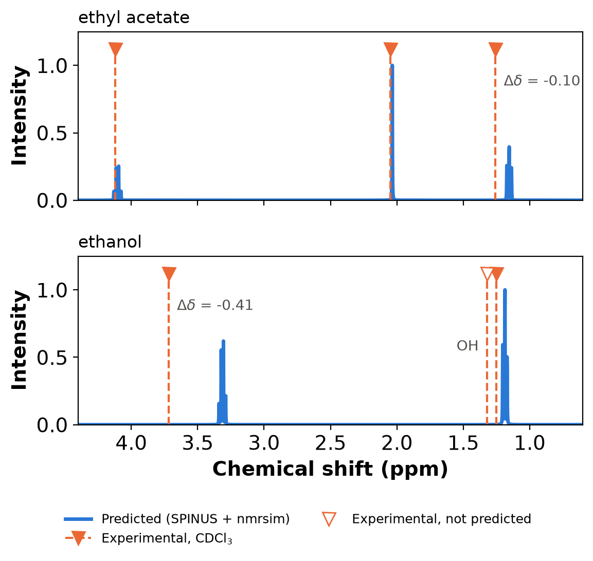

# Ethyl Acetate and Ethanol: Predicted 1H NMR vs. Experiment in CDCl3

## Goal

Predict the 400 MHz 1H NMR spectra of ethyl acetate and ethanol with `predict_nmr.py`
(NMRdb.org SPINUS shifts and couplings, nmrsim spin simulation). Then check every
signal (chemical shift, multiplicity, J, proton count) against the experimental CDCl3
values tabulated by Fulmer et al. (2010), which repeat the CDCl3 values of
Gottlieb et al. (1997).

Both compounds give first-order A3X2 spin systems, so multiplicity and J can be compared
directly. Ethyl acetate is the main test. Ethanol shows two known limits of SPINUS:
it predicts no exchangeable (OH) protons, and one CH2 signal falls far outside the
typical error.

## Inputs

| Compound | SMILES | Formula | Experimental reference |
|---|---|---|---|
| ethyl acetate | `CCOC(C)=O` | C4H8O2 (8 H) | Fulmer 2010, Table 1, CDCl3 column |
| ethanol | `CCO` | C2H6O (6 H) | Fulmer 2010, Table 1, CDCl3 column |

Settings: `--field_mhz 400`, default `--linewidth 1.0` Hz and `--n_points 8192`
(range −0.5 to 12 ppm). The prediction calls the NMRdb.org web service, so you need
internet access. It takes about 5 s on a CPU.

[literature_cdcl3.csv](literature_cdcl3.csv) holds the experimental values. They were
transcribed from Table 1 of the Fulmer 2010 paper and checked against Table S1 of its
Supporting Information and Table 1 of Gottlieb 1997. All three give the same CDCl3 numbers.

## Commands (run from the repository root)

1. Predict the spectra and signal tables:

```bash
venv/run cpu python skills/chem-nmr-predict/scripts/predict_nmr.py \
  --smiles "CCOC(C)=O" "CCO" \
  --names ethyl_acetate ethanol \
  --field_mhz 400 \
  --output_dir skills/chem-nmr-predict/examples/ethyl_acetate_ethanol_cdcl3
```

2. Compare with the literature and plot. This helper script is specific to this example.
   It matches each experimental signal to a predicted one by shift and nH, then
   peak-picks and integrates the simulated `.xy` spectrum within ±0.1 ppm of each
   predicted signal:

```bash
venv/run cpu python skills/chem-nmr-predict/examples/ethyl_acetate_ethanol_cdcl3/compare_to_literature.py \
  --pred_dir skills/chem-nmr-predict/examples/ethyl_acetate_ethanol_cdcl3 \
  --literature skills/chem-nmr-predict/examples/ethyl_acetate_ethanol_cdcl3/literature_cdcl3.csv
```

## Output Files

| File | Description |
|---|---|
| [ethyl_acetate.xy](ethyl_acetate.xy), [ethanol.xy](ethanol.xy) | Simulated spectra (ppm, normalized intensity), descending ppm |
| [ethyl_acetate_signals.csv](ethyl_acetate_signals.csv), [ethanol_signals.csv](ethanol_signals.csv) | Predicted signal tables (`shift_ppm`, `multiplicity`, `J_Hz`, `nH`) |
| [predictions.json](predictions.json) | Manifest: 2 found, 0 failed |
| [input_configs.yaml](input_configs.yaml) | All `predict_nmr.py` arguments, including defaults |
| [literature_cdcl3.csv](literature_cdcl3.csv) | Experimental CDCl3 signals used as reference |
| [comparison.csv](comparison.csv) | Per-signal comparison, with line count, line spacing and integral measured from the `.xy` spectrum |
| [nmr_vs_literature.png](nmr_vs_literature.png) (`.svg`) | Predicted spectra with the experimental shifts marked |

The script ran without errors. SPINUS returned 8 H atoms for ethyl acetate and 5 H atoms
for ethanol, which has 6 H. The missing proton is the OH (see Discussion).

## Comparison with Literature (CDCl3)

The experimental values come from Fulmer et al. 2010, Table 1. They were recorded at
298 K on 300, 500 or 600 MHz spectrometers, with trace amounts of each compound in
CDCl3. The same CDCl3 values appear in Gottlieb et al. 1997, Table 1 (300 MHz). The
tables give J only to the nearest integer ("q, 7"). Shifts in ppm and J in Hz do not
depend on the field, so they can be compared with the 400 MHz prediction.

| Compound | Group | nH exp / pred | δ exp (ppm) | δ pred (ppm) | \|Δδ\| (ppm) | Mult. exp / pred | J exp / pred (Hz) |
|---|---|---|---|---|---|---|---|
| ethyl acetate | CH3CO | 3 / 3 | 2.05 | 2.035 | 0.015 | s / s | – / – |
| ethyl acetate | CH2 (OCH2CH3) | 2 / 2 | 4.12 | 4.104 | 0.016 | q / q | 7 / 7.1 |
| ethyl acetate | CH3 (OCH2CH3) | 3 / 3 | 1.26 | 1.155 | 0.105 | t / t | 7 / 7.1 |
| ethanol | CH3 | 3 / 3 | 1.25 | 1.187 | 0.063 | t / t | 7 / 6.6 |
| ethanol | CH2 | 2 / 2 | 3.72 | 3.314 | **0.406** | q / q | 7 / 6.6 |
| ethanol | OH | 1 / – | 1.32 | not predicted | – | s / – | – |

**Mean absolute shift error (CHn signals):** ethyl acetate 0.045 ppm (3 signals),
ethanol 0.235 ppm (2 signals), all 5 matched signals 0.121 ppm.

**Checks on the simulated spectrum** (from `comparison.csv`):

| Signal | Lines resolved | Line spacing (Hz) | Integral (H) |
|---|---|---|---|
| ethyl acetate 4.104 q | 4 | 7.11 | 2.00 |
| ethyl acetate 2.035 s | 1 | – | 3.02 |
| ethyl acetate 1.155 t | 3 | 7.06 | 2.99 |
| ethanol 3.314 q | 4 | 6.62 | 2.01 |
| ethanol 1.187 t | 3 | 6.53 | 2.99 |

The nmrsim spectrum has the expected first-order patterns: a 4-line quartet, a
3-line triplet and a singlet. The line spacings match the SPINUS J values within the
0.6 Hz grid spacing of the 8192-point spectrum. The integrals give back the 2:3:3 and
2:3 proton ratios.

### Against the published accuracy of SPINUS

The papers behind SPINUS report these mean absolute errors for CHn protons on
independent test sets:

| Model (paper) | Test set | MAE (ppm) | MAE, best 90% (ppm) |
|---|---|---|---|
| Counterpropagation NN (Aires-de-Sousa, Hemmer & Gasteiger 2002) | 259 protons | 0.25 | 0.19 |
| Feed-forward NN ensembles, CDCl3 (Binev & Aires-de-Sousa 2004) | 952 protons | 0.29 | 0.20 |
| Associative NN with added data (Binev, Corvo & Aires-de-Sousa 2004) | 952 protons | 0.19 | 0.13 |

- **Ethyl acetate:** MAE 0.045 ppm, well within the published range. Every shift is
  within 0.11 ppm, and the multiplicities, J (7.1 Hz vs. tabulated 7 Hz) and proton
  counts all match.
- **Ethanol:** the CH3 triplet is within 0.06 ppm, but the CH2 quartet is 0.41 ppm
  too far upfield. That error is about twice the published MAE and lies in the
  worst-10% tail that the "90%" MAE leaves out. The ethanol MAE (0.235 ppm) is close
  to the published 0.19–0.29 ppm. The predicted J of 6.6 Hz agrees with the tabulated
  "7" (an integer) to within its rounding.
- **All five CHn signals:** MAE 0.121 ppm, below every published MAE in the table.
  With only five signals, this is a sanity check, not a benchmark.

## Discussion and Caveats

- **Exchangeable protons are not predicted.** SPINUS was trained only on protons
  bonded to carbon (the 2002 and 2004 papers describe "CHn" protons). NMRdb.org therefore returns no
  shift for the ethanol OH, and the `ethanol_signals.csv` table sums to 5 H instead of
  6 H. If Step 3 of the skill flags a proton-count mismatch, first check for OH, NH or
  SH protons. In any case their experimental shift depends on concentration and
  temperature: the ethanol OH appears at 1.32 ppm in CDCl3 but at 4.63 ppm in DMSO-d6
  (Fulmer 2010, Table 1).
- **Treat a single shift as uncertain by a few tenths of a ppm.** The ethanol CH2 error
  of 0.41 ppm shows that even small molecules can fall in the error tail. To tell
  structures apart, compare the whole pattern (multiplicities, integrals, relative order)
  rather than one shift.
- **Solvent and conditions.** The experimental values are for dilute (trace) solutions
  in CDCl3. SPINUS takes no solvent input, but its feed-forward networks were trained on
  CDCl3 data. In other solvents, expect shifts to differ by up to several tenths of a ppm
  (see the solvent columns of Fulmer 2010, Table 1).
- **The prediction is deterministic.** The server builds its own geometry: sending a
  2D molfile with or without H, or 3D ETKDG conformers from different random seeds,
  returned the same shifts for both compounds.



*Predicted 400 MHz spectra (blue) with the experimental CDCl3 shifts of Fulmer et al.
2010 (orange dashed lines). The hollow marker is the ethanol OH signal, which SPINUS does
not predict. Δδ = δ_pred − δ_exp is labelled where |Δδ| ≥ 0.1 ppm.*

## References

- G. R. Fulmer, A. J. M. Miller, N. H. Sherden, H. E. Gottlieb, A. Nudelman, B. M. Stoltz,
  J. E. Bercaw, K. I. Goldberg, "NMR Chemical Shifts of Trace Impurities: Common Laboratory
  Solvents, Organics, and Gases in Deuterated Solvents Relevant to the Organometallic
  Chemist", *Organometallics* **2010**, 29, 2176–2179.
  [DOI: 10.1021/om100106e](https://doi.org/10.1021/om100106e). The Supporting Information
  (Table S1) is openly available from
  [CaltechAUTHORS](https://authors.library.caltech.edu/records/q3m5b-fec90).
- H. E. Gottlieb, V. Kotlyar, A. Nudelman, "NMR Chemical Shifts of Common Laboratory
  Solvents as Trace Impurities", *J. Org. Chem.* **1997**, 62, 7512–7515.
  [DOI: 10.1021/jo971176v](https://doi.org/10.1021/jo971176v)
- J. Aires-de-Sousa, M. C. Hemmer, J. Gasteiger, "Prediction of 1H NMR Chemical Shifts
  Using Neural Networks", *Anal. Chem.* **2002**, 74, 80–90.
  [DOI: 10.1021/ac010737m](https://doi.org/10.1021/ac010737m)
- Y. Binev, J. Aires-de-Sousa, "Structure-Based Predictions of 1H NMR Chemical Shifts Using
  Feed-Forward Neural Networks", *J. Chem. Inf. Comput. Sci.* **2004**, 44, 940–945.
  [DOI: 10.1021/ci034228s](https://doi.org/10.1021/ci034228s)
- Y. Binev, M. Corvo, J. Aires-de-Sousa, "The Impact of Available Experimental Data on the
  Prediction of 1H NMR Chemical Shifts by Neural Networks", *J. Chem. Inf. Comput. Sci.*
  **2004**, 44, 946–949. [DOI: 10.1021/ci034229k](https://doi.org/10.1021/ci034229k)
- D. Banfi, L. Patiny, "www.nmrdb.org: Resurrecting and Processing NMR Spectra On-line",
  *Chimia* **2008**, 62, 280–281.
  [DOI: 10.2533/chimia.2008.280](https://doi.org/10.2533/chimia.2008.280)
