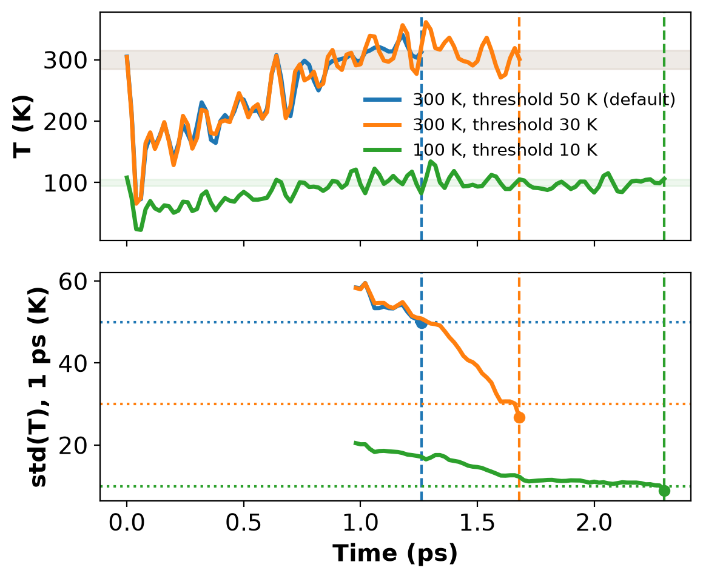
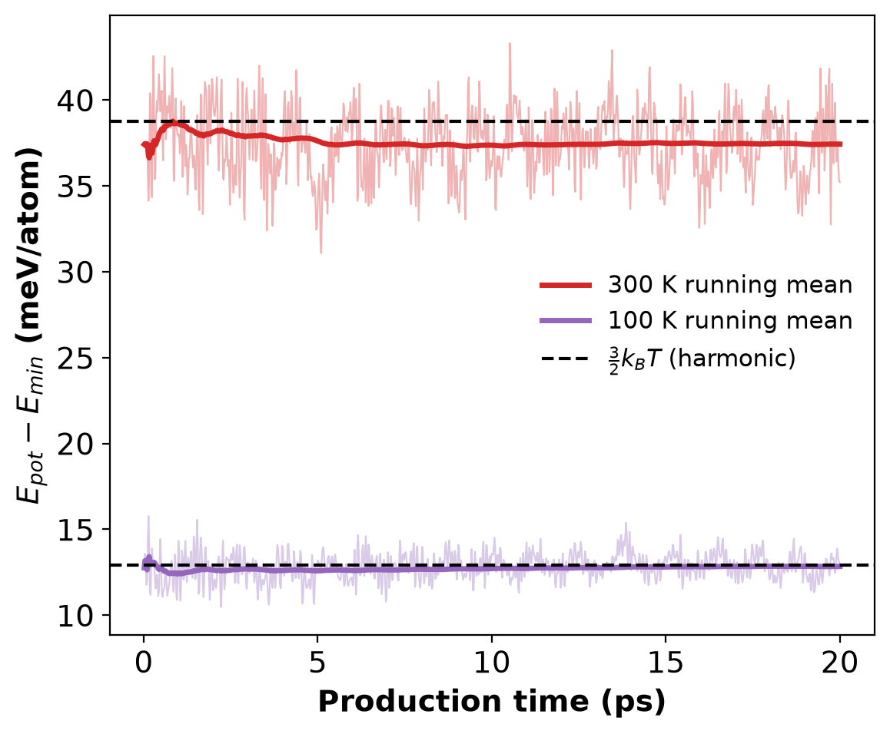

# Equilibration and explosion monitors on FCC Cu (NVT, MACE-MP-small)

## Goal

Show where the `equilibration` monitor of `mace.run_md` stops an NVT run, and why,
then check the physics of the equilibrated state against classical theory:

- the mean kinetic temperature against the thermostat target;
- the std of the instantaneous temperature against the canonical value
  $\sigma_T = T\sqrt{2/(3N)}$;
- the mean potential-energy rise above the relaxed minimum against equipartition
  for a harmonic solid, $\langle E_{pot}-E_{min}\rangle = \tfrac{3}{2}k_BT$ per atom;
- the heat capacity against the Dulong–Petit limit $c_v = 3k_B$ per atom ($3R$ per mole).

The `explosion` monitor (stop if T > 10 000 K or NaN) runs in every stage as a safety check.

## System and settings

| Item | Value |
| :--- | :--- |
| Structure | FCC Cu, conventional cell relaxed with `relax_cell=true`, expanded by `supercell_min_length=14` to 4×4×4 = **256 atoms** |
| Model | `MACE-MP-small` (MACE-MP-0 small; float32 in MD), `mlip` env |
| Ensemble | `nvt` = ASE `NoseHooverChainNVT`, `tdamp` = 100 × timestep = 200 fs |
| Timestep / logging | 2 fs, one log line every 10 steps (20 fs) |
| Equilibration monitor | 1 ps window (50 log entries); stops when std(T) < `temp_std_threshold` |
| Production | 20 ps NVT restarted from the last equilibration frame (positions and momenta) |
| Hardware | NVIDIA GB10, unified memory. Peak process RSS 2.1 GB, peak GPU 1.1 GB (measured on a 300-step rerun of the same system); about 55 ms/step including trajectory I/O |

## Commands (repository root)

`OUT` is any scratch directory. Initial velocities are drawn from a Maxwell–Boltzmann
distribution without a fixed seed, so stop times differ by a few tenths of a ps between runs.

```bash
OUT=.agents/test/md_monitors_Cu
mkdir -p $OUT && cp skills/mat-md-monitors/examples/Cu_nvt_equilibration/Cu_conventional.cif $OUT/

# Step 0 + stage 1: relax the cell, then NVT at 300 K with the default monitor (threshold 50 K)
venv/run mlip python -m src.mcp_server.cli mace \
  load_model model_name=MACE-MP-small device=cuda \
  relax_structure structure_data=$OUT/Cu_conventional.cif fmax=0.001 relax_cell=true output_dir=$OUT/relax \
  run_md structure_data=$OUT/relax/relaxed_structure.cif temperature=300 steps=10000 timestep=2.0 \
    ensemble=nvt log_interval=10 supercell_min_length=14 monitor=true \
    'monitor_type=["explosion","equilibration"]' output_dir=$OUT/stage1_equilibration

# Stage 1b: the same run with temp_std_threshold = 30 K (about 2 sigma_T for N = 256)
venv/run mlip python -m src.mcp_server.cli mace \
  load_model model_name=MACE-MP-small device=cuda \
  run_md structure_data=$OUT/relax/relaxed_structure.cif temperature=300 steps=10000 timestep=2.0 \
    ensemble=nvt log_interval=10 supercell_min_length=14 monitor=true \
    'monitor_type=["explosion","equilibration"]' 'monitor_params={"temp_std_threshold": 30.0}' \
    output_dir=$OUT/stage1b_equilibration_30K

# Stage 2: 20 ps production restarted from the stage-1b trajectory (keeps the velocities)
venv/run mlip python -m src.mcp_server.cli mace \
  load_model model_name=MACE-MP-small device=cuda \
  run_md structure_data=$OUT/stage1b_equilibration_30K/Cu256_300.0K_nvt.traj temperature=300 steps=10000 \
    timestep=2.0 ensemble=nvt log_interval=10 monitor=true monitor_type=explosion \
    output_dir=$OUT/stage2_production

# Same protocol at 100 K (threshold 10 K), used for the anharmonicity and Dulong-Petit checks
venv/run mlip python -m src.mcp_server.cli mace \
  load_model model_name=MACE-MP-small device=cuda \
  run_md structure_data=$OUT/relax/relaxed_structure.cif temperature=100 steps=10000 timestep=2.0 \
    ensemble=nvt log_interval=10 supercell_min_length=14 monitor=true \
    'monitor_type=["explosion","equilibration"]' 'monitor_params={"temp_std_threshold": 10.0}' \
    output_dir=$OUT/T100_stage1_equilibration \
  run_md structure_data=$OUT/T100_stage1_equilibration/Cu256_100.0K_nvt.traj temperature=100 steps=10000 \
    timestep=2.0 ensemble=nvt log_interval=10 monitor=true monitor_type=explosion \
    output_dir=$OUT/T100_stage2_production
```

With a connected MCP server, the stage-1 call is

```python
mace.run_md(
    structure_data="relax/relaxed_structure.cif",
    temperature=300.0, steps=10000, timestep=2.0, ensemble="nvt", log_interval=10,
    supercell_min_length=14.0,                     # 4x4x4 conventional cells, 256 atoms
    monitor=True, monitor_type=["explosion", "equilibration"],
    monitor_params={"temp_std_threshold": 30.0},   # omit for the 50 K default
    output_dir="stage1b_equilibration_30K",
)
```

Analysis (CPU). This rebuilds `results/` from the logs stored in this folder; point the
paths at `$OUT` to analyse a fresh run:

```bash
EX=skills/mat-md-monitors/examples/Cu_nvt_equilibration
venv/run cpu python $EX/analyze_md_monitor_run.py \
  --relax-dir $EX/relax \
  --stage1-logs $EX/stage1_equilibration/Cu256_300.0K_nvt.log \
                $EX/stage1b_equilibration_30K/Cu256_300.0K_nvt.log \
                $EX/T100_stage1_equilibration/Cu256_100.0K_nvt.log \
  --stage1-labels "300 K, threshold 50 K (default)" "300 K, threshold 30 K" "100 K, threshold 10 K" \
  --production-logs $EX/stage2_production/Cu256_300.0K_nvt.log \
                    $EX/T100_stage2_production/Cu256_100.0K_nvt.log \
  --n-atoms 256 --n-blocks 5 --output-dir $EX/results
```

## Files

| File | Content |
| :--- | :--- |
| `Cu_conventional.cif`, `relax/` | input cell; relaxed cell, energy and FIRE log from `relax_structure` |
| `*/Cu256_*K_nvt.log`, `*/md_inputs.json` | ASE MD logs and the `run_md` inputs of each stage (trajectories are not kept) |
| `run_md_results.json` | `status` and `stop_reason` returned by each `run_md` call |
| `analyze_md_monitor_run.py` | analysis script (monitor stop points, theory comparison, plots) |
| `results/md_monitor_validation.json` | all numbers quoted below; `results/input_configs.yaml` records the analysis arguments |
| `results/equilibration_monitor.png/.svg`, `results/potential_energy_equipartition.png/.svg` | figures |

## Results

### Where the monitor stopped the run, and why

The relaxed lattice constant is a = 3.6127 Å and $E_{min}$ = −4.09042 eV/atom.
`run_md` returned `status: "stopped"` with the `stop_reason` below for every equilibration run
(`run_md_results.json`). The analysis script recomputes the std(T) of the last 1-ps window
from the log and reproduces each value in the stop reason.

| Run | Target T | `temp_std_threshold` | Stopped at | `stop_reason` | T at stop | Max T before stop |
| :--- | :---: | :---: | :---: | :--- | :---: | :---: |
| `stage1_equilibration` | 300 K | 50 K (default) | 1.26 ps (step 630 / 10000) | `Equilibration reached: std(T)=49.78 < 50.0` | 312.3 K | 340.2 K |
| `stage1b_equilibration_30K` | 300 K | 30 K | 1.68 ps (step 840 / 10000) | `Equilibration reached: std(T)=26.77 < 30.0` | 301.0 K | 361.0 K |
| `T100_stage1_equilibration` | 100 K | 10 K | 2.30 ps (step 1150 / 10000) | `Equilibration reached: std(T)=8.89 < 10.0` | 106.2 K | 134.4 K |



*Top: instantaneous temperature; shaded bands are T ± σ_T (canonical). Bottom: std(T) over
the trailing 1-ps window that the monitor evaluates; dotted lines are the thresholds and
dashed lines mark the steps where each run was stopped.*

Velocities are drawn at the relaxed minimum. By equipartition, T falls to about half the target
within 50 fs. The Nosé–Hoover chain then heats the crystal back, overshooting between about
1.0 and 1.3 ps. The 1-ps std(T) shrinks as this transient leaves the window. With the default
50 K threshold the run stopped at 1.26 ps, while the window still held the end of the heating
ramp and T was still overshooting. For N = 256 the canonical σ_T is only 15.3 K, so
std(T) < 50 K is a loose criterion. With a threshold of about 2σ_T (30 K) the monitor waited
until the overshoot had decayed, stopping at 1.68 ps. **Choose
`temp_std_threshold` ≈ 2·T·√(2/(3N))** rather than the fixed 50 K default when the
stopping point is to mark the start of production.

The `explosion` monitor never fired. The maximum T in production was 348 K (300 K run) and 119 K
(100 K run), far below 10 000 K. Its trigger path is covered by the unit tests in
`tests/test_md_utils.py`.

### Equilibrated state against theory

Production: 20 ps (1000 samples), restarted from the last equilibration frame. Errors are
standard errors from 5 blocks of 4 ps.

| Quantity | 300 K run | Reference (300 K) | 100 K run | Reference (100 K) |
| :--- | :---: | :---: | :---: | :---: |
| ⟨T⟩ | 296.9 ± 1.2 K | 300 K (target), −1.0 % | 100.2 ± 0.6 K | 100 K (target), +0.2 % |
| std of instantaneous T | 15.29 K | 15.31 K = T√(2/(3N)) [2], −0.2 % | 6.10 K | 5.10 K [2], +20 % |
| ⟨E_pot − E_min⟩ (meV/atom) | 37.44 ± 0.14 | 38.78 = (3/2)k_B·300 K [1,3], −3.5 % | 12.84 ± 0.08 | 12.93 = (3/2)k_B·100 K, −0.7 % |
| ⟨E_kin⟩ (meV/atom) | 38.38 ± 0.15 | (3/2)k_B⟨T⟩ = 38.38 (by definition of T) | 12.95 ± 0.08 | 12.95 |
| ⟨E_pot − E_min⟩ / ⟨E_kin⟩ | 0.975 ± 0.004 | 1 (harmonic) | 0.991 ± 0.006 | 1 (harmonic) |

Dulong–Petit from the two production runs:
$c_v = \Delta\langle E_{tot}-E_{min}\rangle/\Delta\langle T\rangle$ = **2.951 ± 0.020 k_B per atom
= 24.54 ± 0.16 J mol⁻¹ K⁻¹**, against $3R$ = 24.94 J mol⁻¹ K⁻¹ [2,3] (−1.6 %).



*Potential-energy rise per atom during production (thin lines) with running means (thick)
and the harmonic equipartition values (dashed).*

Interpretation:

- **Temperature control.** ⟨T⟩ is within 1 % of the target at 300 K and within 0.2 % at 100 K.
  At 300 K the deviation is 2.6 block-SEM. The slow thermostat oscillation correlates the
  4-ps blocks, so these SEMs are lower bounds.
- **Canonical fluctuations.** At 300 K, std(T) agrees with Eq. (9) of Hickman & Mishin [2],
  ⟨(ΔT̂)²⟩ = 2T₀²/(3N), to 0.2 %. At 100 K it is 20 % too large. The crystal is closer to
  harmonic there, and harmonic systems are the classic case in which Nosé–Hoover dynamics fails
  to sample the canonical distribution [5,6]. The chain thermostat reduces this but does not
  remove it in 20 ps. Use a longer run, or `nvt_langevin`, when canonical fluctuations at low T
  matter.
- **Equipartition.** For a harmonic solid, ⟨E_pot − E_min⟩ = ⟨E_kin⟩, which is (3/2)k_BT per
  atom [1,3]. The measured ratio is 0.975 at 300 K and 0.991 at 100 K. The deviation falls
  from −2.5 % to −0.9 %, a factor of 2.8 for a factor of 3 in temperature. That is the
  signature of the leading anharmonic term (∝ T² in the potential energy), and the ratio goes
  to 1 as T → 0. The few-percent shortfall at 300 K is a property of the MACE-MP-small Cu
  potential-energy surface at fixed volume (a = 3.6127 Å). It is not a sampling or monitor
  artefact. The same anharmonic term puts the finite-difference c_v 1.6 % below 3R.
- **Fixed centre of mass.** `run_md` removes centre-of-mass motion, while ASE's
  `NoseHooverChainNVT` thermostats 3N degrees of freedom. The harmonic expectation is therefore
  ⟨E_pot − E_min⟩ = (3/2)k_B T per atom exactly. A thermostat that counts 3N − 3 degrees of
  freedom would instead give (3/2)k_B T (1 − 1/N), i.e. 0.15 meV/atom (0.4 %) less for
  N = 256. That is below the statistical error.

Quantum effects (Cu Debye temperature ≈ 343 K) make the experimental heat capacity of Cu at
300 K lower than 3R. Classical MD is compared with the classical limit only.

## Implementation notes

This example needed three fixes in `src/utils/mlips/` (covered by `tests/test_md_utils.py`):

1. `run_md` read `Atoms.get_velocities()`, which returns zeros (never None) when no momenta are
   stored. Every CIF, dict or pymatgen input was treated as a restart. Relaxation and
   Maxwell–Boltzmann initialization were skipped, so a perfect crystal stayed at 0 K. Inputs now
   keep velocities only when they carry non-zero momenta, as a `.traj` frame does (used in
   stage 2 above).
2. `ExplosionMonitor` read the temperature of the caller's `Atoms`. The MD driver integrates a
   copy, so the monitor saw 0 K and could never fire. It now reads `dyn.atoms`, like the other
   monitors.
3. `run_md` now returns `status: "stopped"` and `stop_reason` when a monitor stops the run, as
   this skill documents. It previously returned `status: "success"` with no reason.

## References

1. R. C. Tolman, "A General Theory of Energy Partition with Applications to Quantum Theory",
   *Phys. Rev.* **11**, 261 (1918). [DOI: 10.1103/PhysRev.11.261](https://doi.org/10.1103/PhysRev.11.261)
2. J. Hickman and Y. Mishin, "Temperature fluctuations in canonical systems: Insights from
   molecular dynamics simulations", *Phys. Rev. B* **94**, 184311 (2016).
   [DOI: 10.1103/PhysRevB.94.184311](https://doi.org/10.1103/PhysRevB.94.184311),
   [arXiv:1609.03646](https://arxiv.org/abs/1609.03646). Eq. (9) gives the
   instantaneous-temperature variance 2T₀²/(3N); Eq. (7) the classical harmonic-solid
   c_v = 3k (Dulong–Petit).
3. "Equipartition theorem" (section on solids and the Dulong–Petit law), Wikipedia:
   <https://en.wikipedia.org/wiki/Equipartition_theorem>. 3N independent oscillators,
   average energy 3Nk_BT, molar heat capacity 3R.
4. CODATA 2022 recommended values (NIST): k_B = 8.617 333 262 × 10⁻⁵ eV K⁻¹
   (<https://physics.nist.gov/cgi-bin/cuu/Value?kev>), R = 8.314 462 618 J mol⁻¹ K⁻¹
   (<https://physics.nist.gov/cgi-bin/cuu/Value?r>).
5. G. J. Martyna, M. L. Klein and M. Tuckerman, "Nosé–Hoover chains: The canonical ensemble
   via continuous dynamics", *J. Chem. Phys.* **97**, 2635 (1992).
   [DOI: 10.1063/1.463940](https://doi.org/10.1063/1.463940)
6. W. G. Hoover and C. G. Hoover, "Ergodicity of the Martyna–Klein–Tuckerman thermostat and
   the 2014 Snook Prize", [arXiv:1501.06634](https://arxiv.org/abs/1501.06634). Single
   Nosé–Hoover dynamics does not give the canonical distribution of a harmonic oscillator.
7. I. Batatia et al., "A foundation model for atomistic materials chemistry" (MACE-MP-0),
   [arXiv:2401.00096](https://arxiv.org/abs/2401.00096).

## 3D Structures

- [Cu_conventional.cif](Cu_conventional.cif)
- [relax/relaxed_structure.cif](relax/relaxed_structure.cif)
