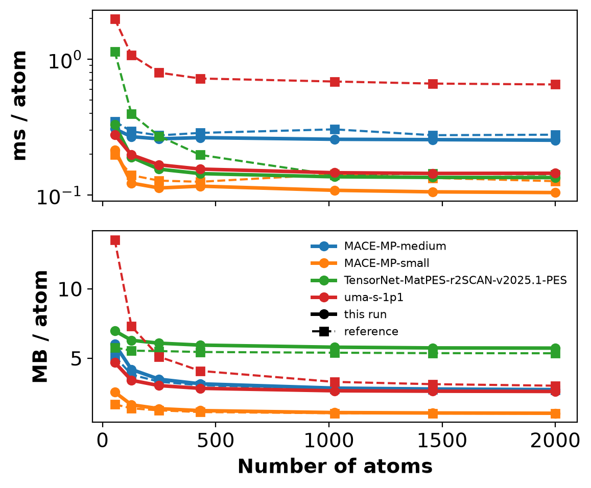

# Small speed benchmark on NaCl supercells (NVIDIA GB10)

## Goal

Re-measure MLIP inference speed (ms per atom per MD step) and peak GPU memory (MB per atom) for
four models up to 2000 atoms. Compare the results with the stored reference
[`resources/speed_benchmark_dgx_spark.yaml`](../../resources/speed_benchmark_dgx_spark.yaml),
which was measured on the same type of machine with an earlier software stack.

## Protocol

`scripts/benchmark_mlips.py` builds rocksalt NaCl supercells (2·n³ atoms, a = 5.64 Å) of
54–2000 atoms and runs 10 NVE velocity-Verlet steps (1 fs, 300 K Maxwell–Boltzmann start) through
each model's ASE calculator. It reports:

- **time:** the mean wall time of the last 5 steps;
- **memory:** the peak `torch.cuda.max_memory_allocated` of those steps.

`--max_atoms_limit 2000` stops the size scan at 2000 atoms.

| Model | Provider (env) | Reference key |
| :--- | :--- | :--- |
| MACE-MP-small | mace (`mlip`) | same |
| MACE-MP-medium | mace (`mlip`) | same |
| TensorNet-MatPES-r2SCAN-v2025.1-PES | matgl (`mlip`) | same; matgl 4.x loads `TensorNet-PES-MatPES-r2SCAN-2025.2` under this name |
| uma-s-1p1 | fairchem (`fairchem`) | same |

## Commands (repository root)

```bash
OUT=.agents/test/speed_2000
venv/run mlip python skills/ml-mlip-speed/scripts/benchmark_mlips.py \
    --models MACE-MP-small MACE-MP-medium TensorNet-MatPES-r2SCAN-v2025.1-PES --providers mace mace matgl \
    --device cuda --max_atoms_limit 2000 --hardware_name NVIDIA_GB10 --output_dir $OUT
venv/run fairchem python skills/ml-mlip-speed/scripts/benchmark_mlips.py \
    --models uma-s-1p1 --providers fairchem \
    --device cuda --max_atoms_limit 2000 --hardware_name NVIDIA_GB10 --output_dir $OUT

# Compare with the stored reference (CPU)
EX=skills/ml-mlip-speed/examples/nacl_gb10_small
venv/run cpu python $EX/compare_with_reference.py $OUT/speed_benchmark.yaml \
    skills/ml-mlip-speed/resources/speed_benchmark_dgx_spark.yaml --output-dir $EX/comparison
```

Both runs add to the same `$OUT/speed_benchmark.yaml`, the default `--results_file`. A first trial
with `--max_atoms_limit 500` confirmed linear memory scaling before the full run.

**Hardware and software:** NVIDIA GB10, unified memory, otherwise idle GPU.
- `mlip` env: torch 2.14.1, mace-torch 0.3.16, matgl 4.1.0.
- `fairchem` env: torch 2.13.0, fairchem-core 2.23.0.

Peak per-process GPU memory was 22.6 GB in the `mlip` run (the caching allocator held memory
across sizes; the largest single allocation was 11.2 GB, TensorNet at 2000 atoms) and 7.8 GB in the
`fairchem` run. Each run takes a few minutes.

## Files

- [`run/speed_benchmark.yaml`](run/speed_benchmark.yaml): results (seconds per step, GB). `run/input_configs.yaml` holds the arguments of the last (FairChem) run.
- [`comparison/comparison_vs_reference.csv`](comparison/comparison_vs_reference.csv) and `comparison/speed_vs_reference.png/.svg`: per-atom comparison with the reference.
- `compare_with_reference.py`: the comparison script.

## Results



*Solid: this run; dashed: stored reference. Top: time per atom per MD step (log scale); bottom:
peak memory per atom.*

Converged values at 2000 atoms (Δ = this run vs reference):

| Model | ms/atom (this run) | ms/atom (reference) | Δ | MB/atom (this run) | MB/atom (reference) | Δ |
| :--- | ---: | ---: | ---: | ---: | ---: | ---: |
| MACE-MP-small | 0.104 | 0.127 | −18 % | 1.02 | 1.00 | +2 % |
| MACE-MP-medium | 0.254 | 0.279 | −9 % | 2.73 | 2.70 | +1 % |
| TensorNet-MatPES-r2SCAN | 0.135 | 0.142 | −5 % | 5.72 | 5.35 | +7 % |
| uma-s-1p1 | 0.145 | 0.653 | **−78 % (4.5× faster)** | 2.59 | 3.01 | −14 % |

- **MACE and TensorNet reproduce the reference.** Asymptotic speeds are within 5–18 % (slightly
  faster now), and memory per atom within 1–7 %. The model ranking is unchanged:
  MACE-MP-small < TensorNet < MACE-MP-medium in ms/atom, and TensorNet uses the most memory per
  atom. The TensorNet memory difference may partly come from the weights matgl 4.x now loads under
  the old name.
- **Small cells are overhead-dominated.** At 54 atoms every model is 1.2–2.4× slower per atom
  than at 2000 atoms, as `SKILL.md` describes. The current stack has much less constant overhead for
  TensorNet: 0.33 vs 1.14 ms/atom at 54 atoms.
- **uma-s-1p1 is 4.5× faster than the stored value** with the current fairchem-core 2.23.0.
  The reference does not record the fairchem version it used, so the cause is not pinned down
  here. Treat the stored uma timings as outdated, and re-measure FairChem models before choosing
  between them on speed.
- Memory per atom converges by about 1000 atoms. Multiply MB/atom by the system size to estimate
  peak GPU memory, and add the caching allocator's headroom: process-level usage was about 2× the
  peak allocation here.
